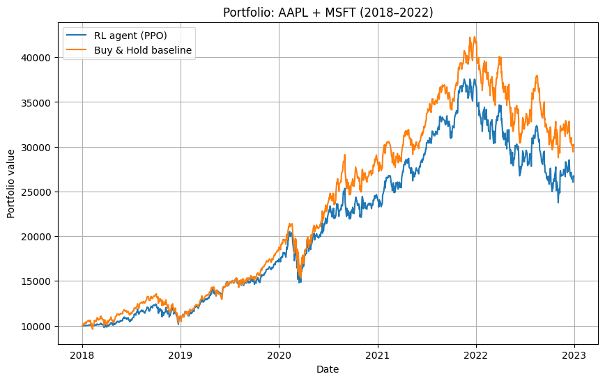

# Finrl_demo
This repository contains a reinforcement learning demo for stock trading using the FinRL framework.  

- **Portfolio:** AAPL + MSFT  
- **Algorithm:** PPO (Proximal Policy Optimization)  
- **Transaction Cost:** 0.1% per trade  

The RL strategy outperformed the buy-and-hold baseline during certain periods while showing higher volatility.  

## Run on Colab
You can open and run the notebook directly in Colab:  
)

## Result
Below is the cumulative return curve comparing the RL strategy with the buy-and-hold baseline:

